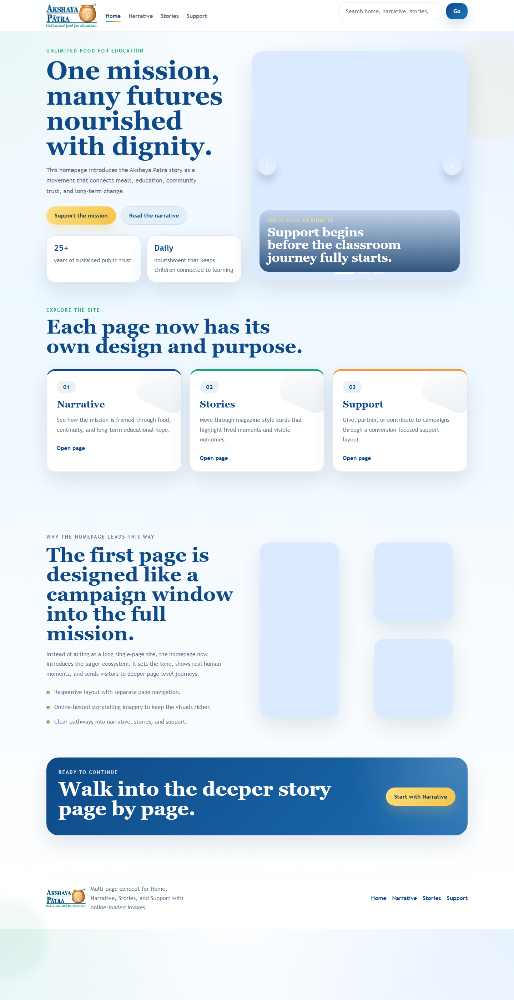
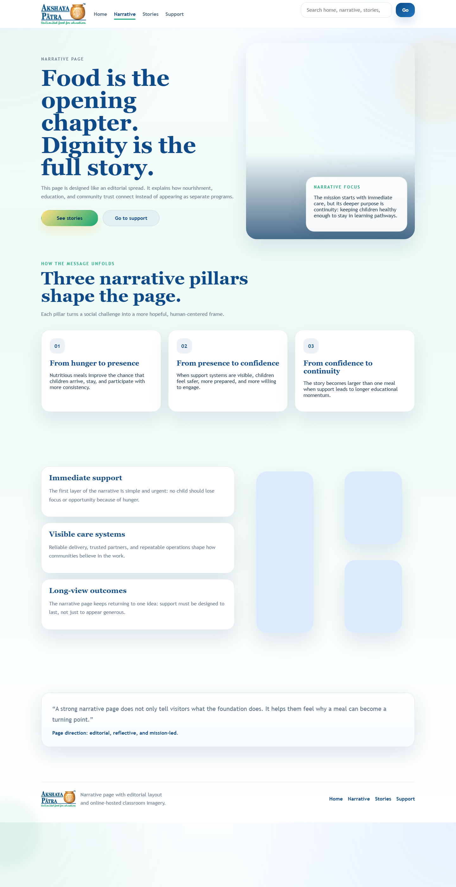
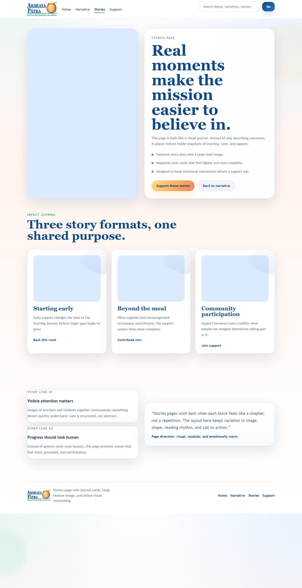
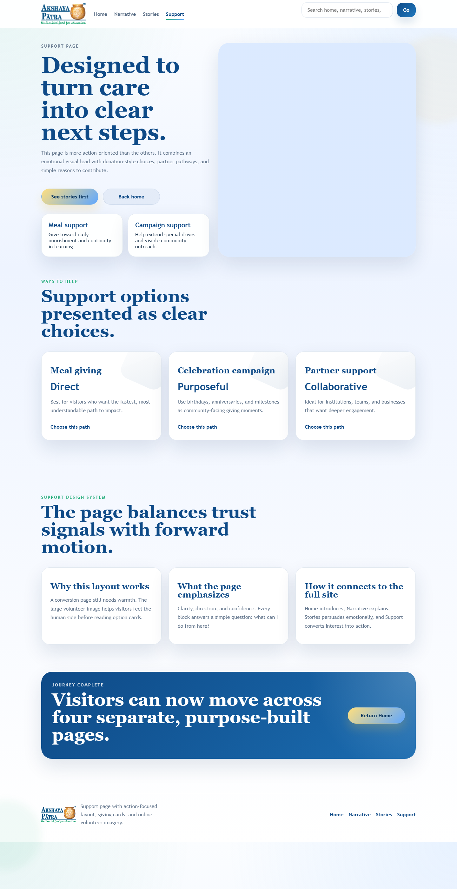
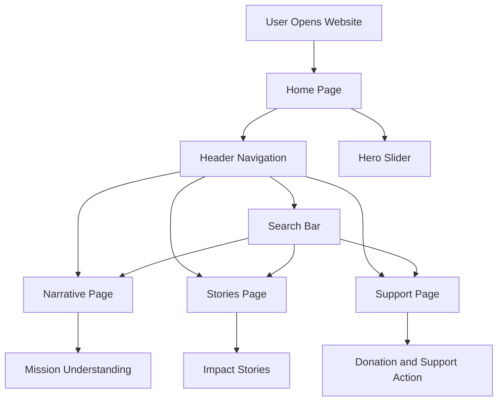
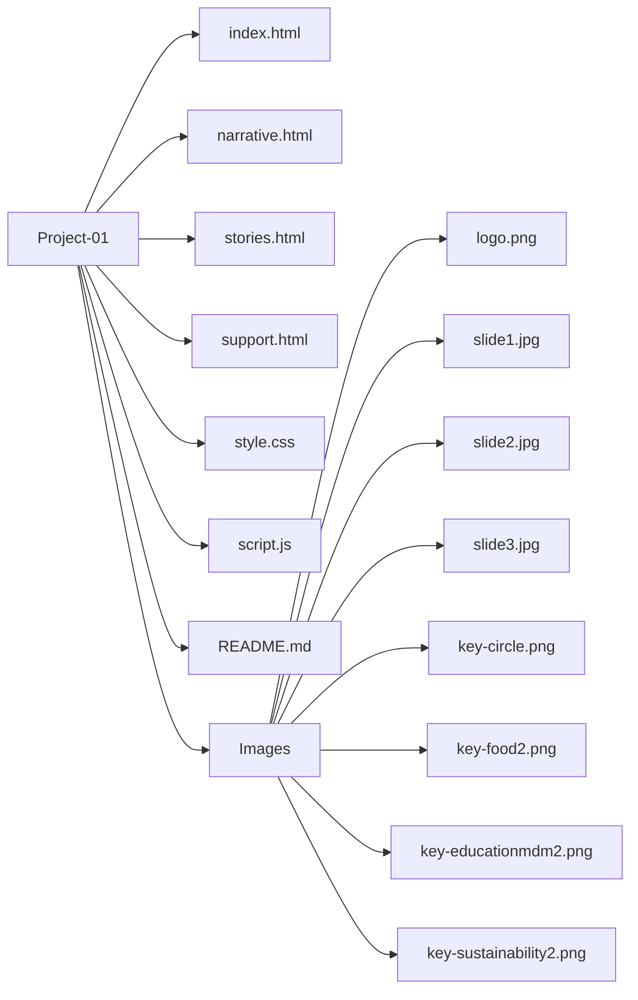

# Akshaya Patra Multi-Page Website

An interactive multi-page website concept for **Akshaya Patra**, designed to present the mission through storytelling, visual impact, and support-focused user journeys.

## Project Preview

<p align="center">
  
</p>

## Pictorial Images

<p align="center">
  
  
  
</p>

These images help showcase the emotional and visual storytelling style used across the website.

## Demo Images

<p align="center">
  
  
</p>

<p align="center">
  
  
</p>

## Pages Included

- `Home` page with hero slider, navigation, and search
- `Narrative` page for mission explanation
- `Stories` page for impact-based storytelling
- `Support` page for donation and partnership journeys

## Features

- Responsive multi-page layout
- Hero image slider on the homepage
- Search-based page navigation
- Separate storytelling layout for each page
- Clean UI built with HTML, CSS, and JavaScript

## Website Flowchart



## Flowchart Explanation

1. User sabse pehle website open karta hai aur `Home Page` par aata hai.
2. Home page par navigation menu aur search bar dono available hote hain.
3. `Hero Slider` homepage ko visually engaging banata hai.
4. User `Narrative Page` par jaakar mission aur purpose samajh sakta hai.
5. User `Stories Page` par real impact aur storytelling dekh sakta hai.
6. User `Support Page` par jaakar action le sakta hai, jaise support ya partnership.
7. Search bar se bhi directly required page par navigate kiya ja sakta hai.

## Flowchart Style Project Structure



## Folder Structure

```text
Project-01/
|-- index.html
|-- narrative.html
|-- stories.html
|-- support.html
|-- style.css
|-- script.js
|-- README.md
|-- home-check.png
|-- narrative-check.png
|-- stories-check.png
|-- support-check.png
`-- Images/
    |-- logo.png
    |-- slide1.jpg
    |-- slide2.jpg
    |-- slide3.jpg
    |-- key-circle.png
    |-- key-food2.png
    |-- key-educationmdm2.png
    `-- key-sustainability2.png
```

## Tech Stack

- HTML5
- CSS3
- JavaScript

## How to Run

1. Open the project folder.
2. Run `index.html` in your browser.
3. Use the navigation bar or search bar to explore other pages.

## Author

**Aayush Sharma**
